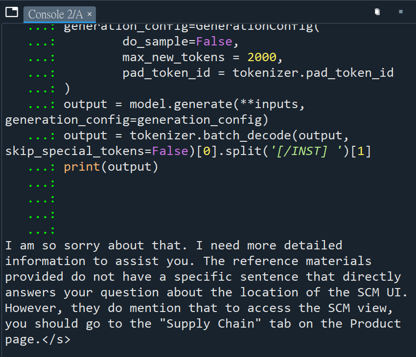
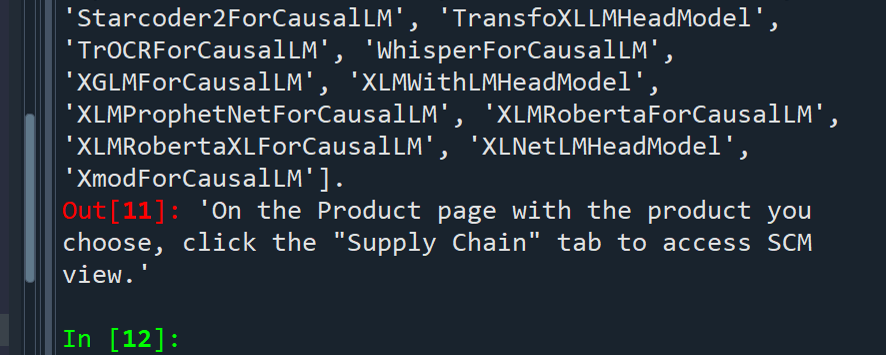

# 專案名稱: GenFAQ 智慧問答系統

## 💡專案簡介
本專案展示如何以開源大型語言模型（LLM）為基礎，實作 **DPO（Direct Preference Optimization）微調** 與 **RAG（Retrieval-Augmented Generation）檢索增強問答**。  
展現完整的 AI 工程實踐流程：資料前處理 → 模型微調 → 推論 → 檢索整合 → 結果展示。

---
## 🎯 專案動機

隨著大型語言模型（LLM）快速進步，企業開始希望能將模型應用於內部客服、文件查詢與知識檢索任務。然而，以下幾個痛點依然存在：

1. **模型回答不精確**：開源模型常出現幻覺（hallucination），對特定領域問題無法提供可信答案。  
2. **訓練成本高昂**：全參數微調需要高 GPU 成本與長時間訓練。  
3. **企業知識更新頻繁**：模型無法即時吸收新資訊。
4. **回答冗長** : 模型會產生過多文字，與人類回覆方式不同。

因此，本專案的動機是： 
  ### **結合 DPO 與 RAG 的方法，打造一個「可持續更新、具偏好對齊能力」的智慧問答系統。**

- **DPO 微調**：透過偏好導向訓練（Preference-based Fine-tuning），讓模型更貼近人類期望回答風格。  
- **RAG 結構**：結合知識庫檢索（Chroma + LangChain）與 LLM 推理，確保答案來自真實資料。  
- **Mistral 模型**：使用開源 Mistral-7B，兼具效能與成本平衡。  

此架構可應用於：
- 企業內部文件智能問答系統  
- AI 客服機器人  
- 技術文件自動回覆系統  
- AI 助教或知識導航員  

---
## 🚀 專案內容

### 🔹 DPO 模型微調流程
1. **資料載入與格式化**
   - 以 ChatML 格式建立 `prompt / chosen / rejected` 資料。
2. **LoRA 模型建立**
   - 使用 4-bit 量化 (`BitsAndBytesConfig`) 加速訓練。
3. **DPO 訓練與輸出**
   - `DPOTrainer` 負責偏好導向訓練。
4. **儲存與上傳**
   - 模型儲存在 `outputs/`，可推送至 HuggingFace Hub。

### 🔹 RAG 問答流程
1. **資料前處理**
   - 使用 `CharacterTextSplitter` 切分文字或 Excel。
2. **建立向量資料庫**
   - 採用 `HuggingFaceInstructEmbeddings` 將資料嵌入至 Chroma。
3. **組合檢索與模型**
   - LangChain `RetrievalQA` 結合自訂 Mistral Prompt。
4. **互動問答**
   - 啟動 CLI Demo，輸入問題即能產生回應與引用來源。

---

## ⚙️ 技術棧（Tech Stack）

| 類別 | 技術 |
|------|------|
| 語言 | Python 3.10+ |
| 模型框架 | PyTorch, Transformers, PEFT, TRL |
| 訓練方法 | LoRA, DPOTrainer |
| 向量資料庫 | ChromaDB |
| 檢索框架 | LangChain |
| Embedding 模型 | hkunlp/instructor-large |
| 微調模型 | mistralai/Mistral-7B-Instruct-v0.3 |
| 版本與部署 | HuggingFace Hub, yaml config |

---

## 📈 成果展示

- **每月工單量下降 51.86%**
- **生成回答冗長度下降 20%**
   - ### Query:
     ### where is the SCM UI?
     - beginning version
       
     - fine-tuning version
       

    
---
## 📘 專案核心價值

- 🧩 **技術深度**：結合 Mistral 模型、LoRA、4-bit 量化與 DPO 微調。
- 🔍 **知識檢索**：利用 LangChain + Chroma 構建動態知識庫。
- 🧠 **思維與原創**：自訂 ChatML Prompt、模組化設計、環境隔離。
- 🧰 **工程實務**：遵循 PyPA 的 `src layout` 專案結構，便於維護與部署。
- 🚀 **End-to-End 展現**：從資料到回答，完整閉環。


---

## 🏗️ 專案結構
```
GenFAQ/
├─ bin/
│ ├─ train_dpo.py        # DPO 模型訓練入口
│ ├─ infer.py            # 模型推論腳本
│ ├─ rag_demo.py         # RAG 問答 Demo（互動式）
│ └─ push_to_hub.py      # 將模型上傳至 HuggingFace Hub
│
├─ src/
│ ├─ config.py             # 設定讀取與驗證
│ ├─ data.py               # 資料處理與格式化
│ ├─ modeling.py           # 模型載入、LoRA、PEFT 封裝
│ ├─ training.py           # DPO 訓練模組
│ ├─ utils.py              # 工具模組（logging、seed、環境）
│ └─ rag/                  # 檢索增強問答模組
│   ├─ datastore.py        # Chroma 向量資料庫管理
│   ├─ prompt_template.py  # Prompt 模板（Mistral 專用）
│   └─ retrieval_qa.py     # LangChain 問答流程
├─ conf/
│ └─ config.yaml           # 專案設定
├─ data/
│ └─ ChatbotDBData_answer.xlsx   # RAG 使用的知識資料
├─ outputs/              # 模型輸出與紀錄
├─ docs/
│ └─ images/             # 結果圖、架構圖、示意圖
├─ .env                  # 範例環境變數（含 HF_TOKEN）
├─ requirements.txt      # 套件需求
└─ README.md
```

---

### 🔧 安裝與設定
# 建立虛擬環境
```
python -m venv .venv
source .venv/bin/activate  # Windows: .venv\Scripts\activate
```

# 安裝依賴
```
pip install -r requirements.txt
```
# 複製並設定環境變數
```
cp .env.example .env
# 編輯 .env 並填入 HF_TOKEN
```
---

## 🧩 執行範例

### 1️⃣ DPO 訓練
```bash
python bin/train_dpo.py --cfg conf/config.yaml
```

### 2️⃣ 模型推論
```bash
python bin/infer.py outputs/mistral-7b-dpo-pairs/final_adapter --user "Who is Susan Semin?"
```

### 3️⃣ 啟動 RAG 問答

## 以 Chroma 建立/覆寫索引並互動查詢（使用 base 模型）
```bash
python bin/rag_demo.py --cfg conf/config.yaml --data data/ChatbotDBData_answer.xlsx
```

## 若已完成 DPO 並有 LoRA adapter，可帶入以提升回覆
```bash
python bin/rag_demo.py --cfg conf/config.yaml --adapter outputs/mistral-7b-dpo-pairs/final_adapter
```

### 🔹 範例:
```bash

> input query: 
How to edit the OTS component owner?

> Answer:
Go to Product Page → Click "General" → Edit "Product Properties"
```
---

## 🧠 個人貢獻

- **模型訓練與優化**: 負責 DPO 微調流程設計，使用 LoRA + 4-bit 量化策略降低 GPU 記憶體消耗。
- **資料處理流程**: 資料前處理, 開發文本自動載入與切割模組，整合 HuggingFace Embeddings 與 LangChain。
- **RAG 模組開發**: 實作 `Chroma` 向量資料庫整合，設計檢索管線與自訂 Prompt 模板，支援 Mistral 模型。 |
- **自動化腳本與部署**: 編寫 CLI 腳本（`train_dpo.py`, `rag_demo.py`），支援一鍵啟動、模型訓練與上傳 HuggingFace Hub。 |
- **研究與文獻整合**: 研究 DPO 原理、比較 RAG 架構設計，並融合工程實作與理論概念。 |

---

## 📚 未來改進方向
- 模型優化
- 對話記憶
- 推論效能 


